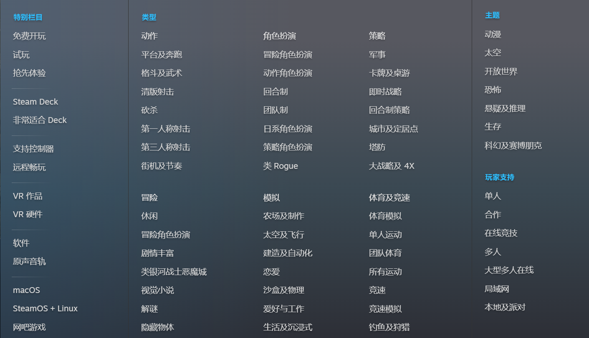

### Determining Engine Features

We are going to write a tiny engine or say a basic structure.

game engine generally contains
- Rendergin Engine
- Input System
- Physics Engine
- Entity-Component System
- Audio Engine
- UI System
- Camera System
- Resource Management
- Save/Load System
- Optimization

The game types that we are focusing on are Action, Role-Playing and Stimulation. More specifically, there is a (or more) character that the player gains control over to a certain extent, and there is a world where the character is placed, with various mechanics integrated to enrich the gameplay such as weapon, crafting, magic, destruction.

The engine focus on 2D game. For now, we don't consider complex ideas such as multithreads, network.

### Engine Layer Architecture

The Engine design is not concerned with specific game implementation.

The engine architecture contains 3 level abstraction
- Platform Abstraction Layer
  Purpose: Deal with platform-specific operations and provide space for customization.
- Core Engine Systems Layer
  Purpose: Implements engine modules on top of the Platform Abstraction.
- Engine API Layer
  Purpose: design and expose interfaces to the user.

In Platform Abstraction Layer, the parts that assotiate with hardware and OS are
- Window management
- Input handling
- Timing and frame management
- OpenGL context initialization
- File system
- Audio API abstraction (not for now)
- Memory management (not for now)
- Networking (not for now)

### New 5 level structure

Platform-Abstraction
Library-Abstraction
Core Engine Component
Engine API
User

